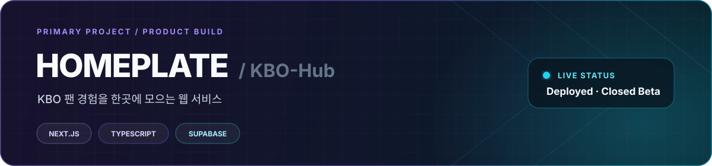

<!-- Portfolio: add the verified production URL when available. -->

  

   

  고객 경험과 콘텐츠에서 시작해, 지금은 웹 제품과 개발 워크플로우를 직접 만들고 운영합니다.

  Customer Experience　→　Content & Operations　→　Web & Automation　→　Product Development

    

  
  
  
  

 

## ✦ Featured Work

  

<table>
  <tr>
    <td width="50%" valign="top">
      <h3><a href="https://github.com/Keyco55/AI-Hub-pet">Doro Hub Pet ↗</a></h3>
      
AI agent 상태와 usage를 보여주는 native macOS floating tool.

      
<code>Swift</code> <code>AppKit</code> <code>macOS</code>

    </td>
    <td width="50%" valign="top">
      <h3><a href="https://github.com/Keyco55/multi-agent-project">Multi-Agent Environment ↗</a></h3>
      
사람이 설계하고 승인하는 role-based agent workflow.

      
<code>Git Worktree</code> <code>cmux</code> <code>Review</code>

    </td>
  </tr>
  <tr>
    <td width="50%" valign="top">
      <h3><a href="https://github.com/Keyco55/Html_test01">Portfolio Web ↗</a></h3>
      
개인 portfolio를 새롭게 확장하고 rebuild하는 프로젝트.

      
<code>Web</code> <code>Content</code> <code>Product</code>

    </td>
    <td width="50%" valign="top">
      <h3><a href="https://github.com/Keyco55/keyco-ai-status-hub">keyco AI Status Hub ↗</a></h3>
      
macOS AI usage status와 model routing을 지원하는 hub.

      
<code>Python</code> <code>macOS</code> · <strong>Public</strong>

    </td>
  </tr>
</table>

 

## ⌁ How I Build

  

| Isolate | Review | Continue |
| :--- | :--- | :--- |
| Feature branch와 worktree로 작업 경계를 분리합니다. | 구현과 independent review를 분리하고 다시 검증합니다. | Notion, Day Log, QA checkpoint와 `HANDOFF`로 맥락을 잇습니다. |

`cmux`는 workspace/session layer이며, agent·model 선택과 최종 판단은 사람이 담당합니다.

 

## ◈ Core Stack

  
  
  
  
  
  
  
  
  
  

 

| Development Environment | Collaboration / Documentation |
| :--- | :--- |
| VS Code · Ghostty · cmux · Yazi · btop · LazyGit | Notion · Jira · Slack · Microsoft Teams |

---

## ◌ GitHub Contributions

  <picture>
    <source media="(prefers-color-scheme: dark)" srcset="https://raw.githubusercontent.com/Keyco55/Keyco55/output/github-contribution-grid-snake-dark.svg" />
    <source media="(prefers-color-scheme: light)" srcset="https://raw.githubusercontent.com/Keyco55/Keyco55/output/github-contribution-grid-snake-light.svg" />
    
  </picture>

   

  <strong>⌁ keyco</strong> 
  Built from customer experience to product development.

<!-- A public email is intentionally omitted until an address is approved. -->
