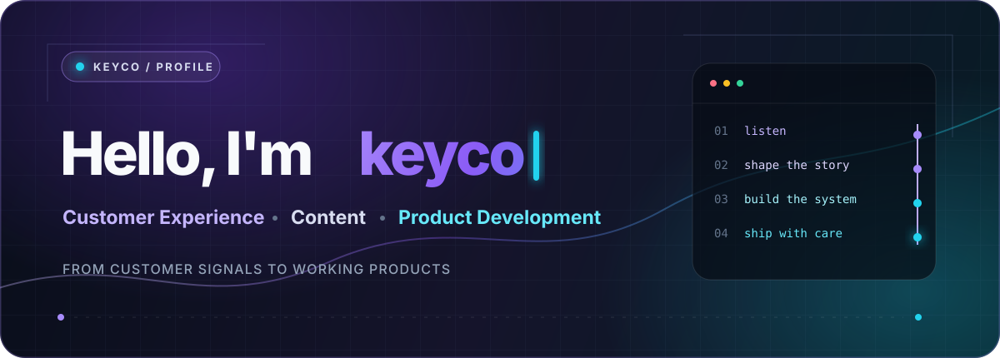
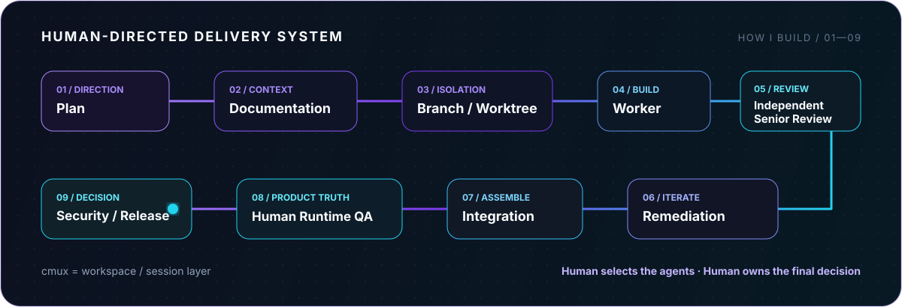

<!-- Portfolio: add the verified production URL to Public Channels when available. -->

  

 

  <strong>Customer Experience · Content · Product Development</strong>
    
  고객 경험과 서비스 운영, 콘텐츠 제작에서 출발해 
  지금은 웹 제품과 자동화, 개발 워크플로우를 직접 만들고 운영합니다.
    
  <code>Customer Experience</code> → <code>Service Operations</code> → <code>Content / Marketing</code> → <code>Web</code> → <code>Automation</code> → <code>Product Development</code>

 

  
  
  
  

---

## ✦ Featured Work

> ### HOMEPLATE / KBO-Hub
> KBO 팬 경험을 한곳에 모으는 웹 서비스입니다. 제품 기획부터 구현, 운영 문서화까지 이어가고 있습니다.
>
> `Next.js` `TypeScript` `Supabase` · **Deployed · Closed Beta**

<table>
  <tr>
    <td width="50%" valign="top"><h3><a href="https://github.com/Keyco55/AI-Hub-pet">Doro Hub Pet ↗</a></h3>
작업 중인 AI agent 상태와 resource usage를 보여주고 해당 세션으로 이동을 돕는 native macOS floating tool입니다.

<code>Swift</code> <code>AppKit</code> <code>macOS</code>
</td>
    <td width="50%" valign="top"><h3><a href="https://github.com/Keyco55/multi-agent-project">Multi-Agent Environment ↗</a></h3>
CLI agent의 역할 분리, Git worktree 격리, independent review와 security gate를 실제 환경에서 실험하고 기록합니다.

<code>Git Worktree</code> <code>cmux</code> <code>CLI Agents</code>
</td>
  </tr>
  <tr>
    <td width="50%" valign="top"><h3><a href="https://github.com/Keyco55/Html_test01">Portfolio Web ↗</a></h3>
Personal portfolio currently being rebuilt and expanded.

<code>Web</code> <code>Content</code> <code>Product</code>
</td>
    <td width="50%" valign="top"><h3>keyco AI Status Hub</h3>
여러 개발 도구의 상태를 한곳에서 확인하기 위한 dashboard입니다.

<strong>Preparing Public Release</strong>
</td>
  </tr>
</table>

---

## ⌁ How I Build

개발은 code 생성만으로 끝내지 않습니다. 사람이 작업 범위와 agent를 결정하고, 격리된 작업 공간에서 구현한 뒤 independent review와 runtime QA를 거쳐 release 여부를 판단합니다.

  

- **Isolation** — feature branch와 agent-per-worktree로 작업 경계를 분리합니다.
- **Independent review** — 구현과 review 역할을 분리하고, remediation 후 다시 검증합니다.
- **Human gate** — 실제 화면과 interaction은 Human Runtime QA를 최종 기준으로 삼습니다.
- **Continuity** — Day log와 `HANDOFF`로 다음 작업이 재현 가능한 checkpoint를 남깁니다.

> `cmux`는 workspace와 session을 구성하는 layer입니다. Agent와 model은 작업의 난이도와 위험도에 따라 사람이 선택합니다.

---

## ◈ Core Stack

  
  
  
  
  
  
  
  
  
  
  
  
  
  

**Backend practice** · `Auth` · `RLS` · `Storage`

### Development Environment

`VS Code` · `Ghostty` · `cmux` · `Yazi` · `btop` · `LazyGit`

`Notion` · `Jira` · `Slack` · `Microsoft Teams`

Jira, Slack, Microsoft Teams는 프로젝트 협업과 실무 커뮤니케이션에 활용합니다.

---

## ◇ Documentation as Part of the Product

Notion을 planning, Day log, design decision, QA checkpoint, handoff와 project archive에 사용합니다. 문서는 결과를 나중에 정리하는 부록이 아니라, 작업 범위와 판단 근거를 유지하는 개발 과정의 일부입니다.

---

## ◌ GitHub Activity

  

---

## ↗ Public Channels

| Channel | Focus |
| --- | --- |
| [GitHub](https://github.com/Keyco55) | Code & Projects |
| [YouTube](https://www.youtube.com/@keyco55) | Video & Content Production |
| [Naver Blog](https://blog.naver.com/qjadn02) | Development · AI · Mac · Project Documentation |
| [Instagram](https://www.instagram.com/sprinrainfa11s/) | @sprinrainfa11s |

<!-- A public email is intentionally omitted until an address is approved. -->

Built from customer experience to product development.

